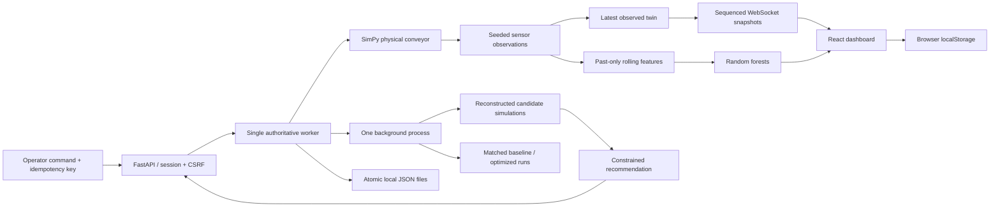

# Technical model and architecture

## Data flow



Only the worker owns the live SimPy environment. The public API validates authentication and forwards control requests to an internal HTTP service protected by a shared random local key. One OS lock prevents duplicate workers on a shared local volume. A bounded process executor allows one training, recommendation or experiment job at a time. Browser disconnects never stop the worker.

The architecture intentionally replaces the requested database layer with local persistence. There are no database dependencies, migrations or services. `data/` has JSON users, sessions, command acknowledgments, current snapshot, run files, experiment files, job status and binary model artifacts. Writes use same-directory temporary files and atomic replacement. This is single-host storage; no multi-instance consistency is claimed.

Browser `localStorage` holds the last selected page, reduced-motion preference, up to eight saved run archives and ten cached experiments. No passwords or session secrets are placed in it. A quota failure when caching a run produces a visible notice; the engine copy remains available. Browser backups are exported from Settings.

## Physical state

The integration interval is **0.2 simulation seconds**. A SimPy generator repeatedly yields a timeout and performs one coupled motion/thermal/admission/service step. Discrete parcel admission, transfer, downstream service and blocking decisions occur within that process. The system uses spatial capacities instead of a misleading one-parcel-per-belt resource.

Each parcel records ID, external arrival time (s), length (m), weight (kg), zone, rear-edge position (m), downstream remaining service work and completion time. Completed parcels leave the active state and contribute their timestamps and cycle times to aggregates.

Each zone has a configurable length, parcel count capacity and weight capacity. Positions are updated downstream-first and front-to-back. For follower `p` and leader `q`:

```text
p.position_next = min(p.position + actual_speed × dt,
                      zone_length − p.length,
                      q.position − p.length − minimum_spacing)
```

The last constraint applies only when a leader exists. A transfer requires both downstream count/weight room and enough entry space. Transfers put the rear edge at zero. A transferred parcel does not receive an additional movement step in the same tick. This introduces at most one tick of transfer delay, a documented discretization assumption.

Targets range 0.2–2.0 m/s. Payload reduces target speed by `1 / (1 + 0.15 × load_fraction)`. Actual speed approaches target with the acceleration bound (default 0.4 m/s²). Changes affect parcels already on the belt at the next integration step. Emergency/thermal stop immediately sets actual speed to zero.

Arrivals use exponential intervals with the configured parcels/min rate. Lengths and weights use bounded uniform distributions. Independent seeded Python RNG streams handle arrivals (seed + 0), properties (+101), service (+202), physical-fault reserve (+303), and sensors (+404). Each parcel receives its service-work draw at creation, not when served; control changes cannot change service randomness for an otherwise identical workload.

The upstream waiting buffer is finite. If it is full, or the line is stopped while simulation time continues, incoming parcels are counted as rejected. Waiting parcels remain inside the system. Thus:

```text
generated = completed + zone parcels + waiting parcels + rejected
accepted = generated − rejected
```

Outfeed service begins when a parcel reaches the physical end. Remaining normalized work is decremented by `service_rate / 60 × dt`. Default service work is uniform from 0.8 to 1.2. A downstream blockage freezes that service. New parcels approaching the station still take physical time to advance, so `service_rate` is a station service parameter, not a guaranteed whole-line throughput.

Geometry, spacing and seed cannot change after simulation time begins; lowering a capacity below its current actual load is rejected.

## Thermal and power equations

For each zone, with `v` in m/s, `L` as payload / weight capacity and `f` friction multiplier:

```text
heating_rate = heating_coefficient × v² × (1 + 2L) × f + heating_fault
dT/dt = heating_rate − cooling_coefficient × (T − ambient)
power_kW = base_power + drive_power × v² × (1 + 2L) × f
energy_kWh += sum(power_kW) × dt / 3600
```

Defaults: ambient 25°C, heating coefficient 0.28°C/s per normalized speed², cooling coefficient 0.012/s, base power 0.12 kW per motor, drive coefficient 0.35 kW per normalized speed². Friction fault multiplies transfer-zone heating/drive by 4; heating fault adds 1.2°C/s in the transfer zone, even while stopped until cleared. Standby electrical draw remains while simulation time advances. These are educational assumptions, not manufacturer specifications.

Warning is 65°C, shutdown 80°C and restart recovery 55°C by default. The temperature alert resolves below warning minus 5°C. Thermal shutdown latches until an explicit restart below recovery; clear a heating fault before restarting. Cooling continues while stopped or emergency-latched, and freezes while paused.

## State machine

| State | Physical time | Movement/admission | Allowed lifecycle action |
|---|---|---|---|
| idle | frozen | no | start, emergency stop, end, new run |
| running | advances | yes | pause, emergency stop, end |
| paused | frozen | no | resume, emergency stop, end |
| emergency | advances | no, arrivals explicitly rejected | clear emergency latch, end |
| stopped | advances/cools | no | explicit start, emergency stop, end |
| thermal | advances/cools | no | start only below recovery, emergency stop, end |
| ended | frozen | no | new run |
| interrupted | frozen history | no | new run |

Clearing emergency stop enters **stopped**, never running. Start/resume cannot clear an emergency latch. Finished-run commands are rejected. `new` requires no active run. Commands are applied in worker request order, immediately acknowledged with ID/status, and cached by idempotency key for the last 1,000 commands. Settings audit entries contain the operator, previous and new configuration, UTC and simulation timestamp. Control retries must reuse the same idempotency key.

## Metrics and observations

- Throughput: completions in the preceding 60 s, scaled to parcels/min; startup uses available elapsed simulation time, minimum denominator one second.
- Mean cycle time: all completed parcels' external arrival-to-discharge durations.
- Queue: upstream waiting plus parcels within 0.25 m of a zone's downstream stopping boundary.
- Occupancy: active zone parcel count / configured zone count capacity. Load percentage uses payload / weight capacity, separately.
- Blocked time: union of integration ticks where a front parcel cannot transfer or outfeed is explicitly blocked. It is not a sum that double-counts simultaneous zones.
- Starved time: running ticks where infeed and upstream buffer are both empty.
- Energy/parcel: total Wh / completed parcels; undefined values are null and shown as an em dash.

Observations are sampled every simulated second. Speed has ±0.008 m/s bounded noise; payload ±0.08 kg; temperature ±0.12°C. Speed/load are lower-bounded at zero. Each zone can be missing independently. A forced sensor fault affects only transfer readings. Missing values stay null; latest valid UTC is carried separately. Aggregate observed speed/load/temperature become null if any component is missing. The dashboard labels the signal as missing rather than showing a healthy zero. Count/energy channels are exact virtual counters computed by the physical model.

The engine exposes three distinct representations: physical state including parcel positions, sensor observation records, and the API/browser's latest received twin. Snapshot metadata includes run ID, schema version, sequence, UTC time and simulation time. Native WebSockets send an initial full snapshot and subsequent complete bounded snapshots with previous-sequence linkage at up to 2 Hz. Full snapshots also serve as heartbeats while paused. Browser reconnection uses exponential delays bounded at 10 s and resynchronizes after sequence mismatch. Slow sends time out after 5 s.

The monotonic driver accumulates elapsed wall time scaled by 1/2/5/10 and advances bounded 0.2-s steps. Individual wall deltas are capped at 0.5 s to avoid unbounded catch-up after a process stall. A long host suspension therefore does not claim real-time continuity; all displayed rates and energy remain tied to actual simulated elapsed time. Snapshots are atomically saved every 5 wall seconds and after commands. Last 7,200 observations per run and 180 observations per live browser payload are retained; longer history remains bounded by that explicit retention rather than hidden sampling.

## Reproducible scenarios

| ID | Seed | Changes | Scheduled events (simulation seconds) |
|---|---:|---|---|
| balanced | 42 | default 22 arrivals/min, 30 service/min | none |
| surge | 73 | defaults | arrival surge on 45, off 180 |
| slow-outfeed | 19 | arrivals 40/min; service 10/min | none |
| heavy | 61 | weight 12–22 kg; arrivals 30/min | none |
| friction | 27 | defaults | transfer friction on 30 |
| sensor | 91 | defaults | transfer dropout on 40, off 85 |
| recovery | 13 | arrivals 30/min | outfeed blockage on 40, off 120 |

Arrival surge multiplies the future arrival rate by 2.5 (capped at 120/min); the one already-scheduled arrival retains its time. Fault schedules remain part of the scenario; manually clearing a fault does not delete its later scheduled events. No random physical fault is silently injected in balanced operation.

## Dataset and machine learning

`python -m app.ml.pipeline --runs 100 --duration 240` generates independent runs with seeds 1000–1099. Scenario families cycle through the seven presets; a separate NumPy stream samples arrival rate 10–58/min, service rate 8–55/min and each target speed 0.25–1.6 m/s. Samples are taken every 5 s after 30 s warmup and only when the full next 60 s is available.

`features()` is shared between training and live inference. It uses a past-only 30-observation window: current/mean speed, mean/std load, mean/trend temperature, queue and growth, occupancy, recent throughput, counter-derived arrival/completion estimates, blocked duration and missing-sensor fraction. Features contain no run IDs, scenario names, future schedules or future observations. Live predictions are suppressed if the latest observation is degraded or more than 20% of the window is degraded.

Bottleneck label: in the **next 60 s**, queue at or above the run's configured queue threshold for at least **10 consecutive sensor samples**, or at least **20 s** of measured blocking. Regression target: actual completions during the next 60 s, expressed as parcels/min.

Complete run IDs are shuffled with seed 2026 and split 60%/20%/20%. Median imputation fits only training data. Both models use 100 trees, bounded depth 12 and minimum leaf size (classifier 5, regressor 4). Classifier is class-weight balanced. Classification threshold is selected from 0.20–0.80 in 0.05 increments to maximize validation F1. Probabilities are **uncalibrated random-forest estimates**, not model accuracy. Held-out test data are evaluated only after threshold selection.

Baseline rule: queue ≥12, or queue growth >0.1 parcels/s with occupancy >65%. Reports include precision/recall/F1, confusion matrix, PR-AUC, class distribution, regression MAE/RMSE and baseline metrics. Metadata includes version, training UTC, features, dataset SHA-256, seeds and complete split IDs. The included model's measured result is in `artifacts/evaluation.json`; no score is hardcoded into the dashboard.

The binary model is locally generated and loaded only from the operator-controlled data directory. It is not a user-upload feature. Do not replace it with an untrusted joblib artifact.

## Optimization

Each recommendation evaluates the current target speeds and five alternatives over a 60-s horizon. Alternatives include reduced speeds, fixed coordinated profiles and ±20% scaled settings bounded to [0.2,2.0]. Six isolated environments are reconstructed from explicit state: active parcels, upstream waiting, motor temperatures, actual speeds, remaining outfeed service work, counters, pending arrival time, schedule index and all RNG states. Active SimPy processes are never serialized or pickled.

The objective is dimensionless:

```text
score = completions/60
      − 0.20 × energy_kWh/0.05
      − 0.35 × max(queue_growth,0)/30
      − 0.15 × max(max_temperature − warning + 10,0)/20
      − 0.10 × predicted_bottleneck_probability
```

If a trained prediction is unavailable, its term is omitted and the result explicitly records `prediction_used=false`. Future completions, energy and temperature always come from a real rollout. A candidate must remain running below the warning threshold, improve score by more than 0.015, and differ from current settings. Otherwise return **No beneficial change found**. The intervention affects speeds, never reduces external arrivals to claim an improvement.

Applying requires matching run, age ≤30 simulation seconds, no intervening settings change, no fault, latest healthy sensor sample, temperature margin and a 30-s adjustment cooldown. A new safety rollout of the proposed speeds checks current conditions again. Acceleration limits remain in force. Automatic mode checks at most once per 60 simulation seconds, audits its changes, and disengages on faults, missing readings or non-running state. Because observation quality uses stochastic missing samples, automatic mode may disengage even during an otherwise stable line; that is deliberate.

## Matched experiments

Experiments run outside the live owner. Each pair uses identical config, seed, duration and schedule. The controller changes only belt speeds. Arrivals/properties/service/fault randomness are independent of controls, so a throughput gain cannot silently alter the external workload. Output includes generated, accepted, completed, rejected and unfinished parcels. Metrics are shown per seed and as means; completion delta includes sample standard deviation when more than one pair exists. Curves show the first matched seed and are explicitly labeled as such.

## Limits

This is a finite-zone teaching model, not an industrial PLC controller. It omits lateral parcel dynamics, belt elasticity, collision impacts, motor current feedback and manufacturing calibration. Recommendations are bounded candidate searches, not global optima. Prediction targets are model-defined congestion events and may be common in the deliberately varied training distribution. There is no calibrated confidence interval, OEE measure or per-prediction causal claim.

Local-file retention and simple process ownership replace database pagination/indexing and distributed queues. Run lists are bounded, UI pagination is ten rows, experiment archive lists the latest 30, and telemetry export is bounded to retained 7,200 rows. For larger multi-host installations a transactional store would require an intentional architecture change.

Primary implementation references: [SimPy environment control](https://simpy.readthedocs.io/en/latest/topical_guides/environments.html), [FastAPI WebSockets](https://fastapi.tiangolo.com/advanced/websockets/), [Vite setup](https://vite.dev/guide/). These informed the environment stepping, WebSocket endpoint and build configuration.
